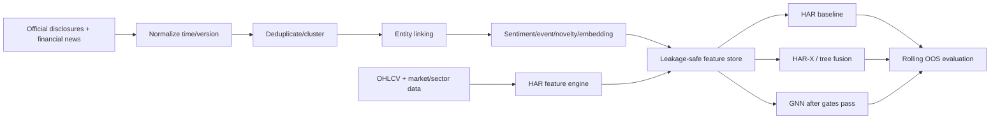

# Claude Development Plan — News-Enhanced HAR + GNN

## 1. Objective

Build a leakage-safe prototype for Vietnamese stock volatility forecasting:

- targets: Parkinson realized volatility `T+1`, `T+5`, `T+10`;
- mandatory baseline: HAR and market-only models;
- add only news features with stable out-of-sample value;
- add GNN only after simpler fusion models succeed.

> Optimize for trustworthy evidence, not model complexity.

## 2. Scope

### First version

- Daily/overnight prediction for VN30 or another fixed liquid universe.
- Official disclosures plus reliable Vietnamese financial news.
- Sentiment, event, novelty, surprise, severity, confidence, relevance, and embeddings.
- HAR, HAR-X, LightGBM/XGBoost, then a small GNN.
- Rolling/expanding evaluation with purging/embargo.

### Do not build initially

- Intraday/HFT trading.
- End-to-end LLM price prediction.
- Large FININ/MSGCA-style models.
- Live order execution.
- GNN before news features are validated.

## 3. Freeze the Prediction Contract First

```yaml
universe: VN30_or_configured_liquid_stocks
timezone: Asia/Ho_Chi_Minh
frequency: daily
primary_target: realized_volatility_t5
other_targets: [realized_volatility_t1, realized_volatility_t10]
news_sessions: [pre_open, in_session, after_close]
```

Rules:

1. Use a news item only after its first known publication time.
2. Store `published_at`, `ingested_at`, and article version/hash.
3. Never use later-edited content for an earlier prediction.
4. Build rolling features, scalers, selectors, and graph edges from past data only.
5. Start with overnight/pre-open experiments because alignment is clearer.

## 4. Minimum Data Contract

### Market data

```text
trade_date, ticker, OHLCV, adjusted_close,
log_return, realized_volatility,
market_return, sector_return
```

HAR/market features:

```text
rv_d, rv_w, rv_m,
return_1d, return_5d,
volume_z_20d, turnover_z_20d, overnight_gap,
market_rv, sector_rv
```

### News data

```text
news_id, source, source_type, url,
published_at, ingested_at, last_seen_at,
headline, body, language,
content_hash, cluster_id,
ticker, entity_confidence, session_bucket
```

### Article-level features

```text
positive, negative, neutral,
fear, optimism, uncertainty,
event_type, event_severity, event_confidence,
entity_relevance, novelty, surprise,
source_reliability, text_embedding
```

Initial event taxonomy:

```text
earnings, earnings_guidance,
dividend_or_corporate_action,
ownership_change, capital_raise,
major_contract, merger_or_acquisition,
legal_or_regulatory, management_change,
credit_or_rating, foreign_ownership_room,
operational_disruption, macro_or_sector, other
```

### Daily ticker-news aggregation

Aggregate only articles available at the prediction cutoff:

```text
article_count, unique_event_count,
weighted_positive, weighted_negative,
max_severity, mean_uncertainty,
mean/max_novelty, mean_entity_relevance,
source_weighted_sentiment,
event counts or event embedding,
recency-weighted text embedding,
news_available
```

Suggested article weight:

```text
entity_relevance × event_confidence × source_reliability × recency_decay
```

## 5. Target Architecture



## 6. Implementation Phases

### Phase 0 — Audit

- Inspect existing repository, data, notebooks, schemas, and targets.
- Document assumptions, data gaps, and leakage risks.
- Create `configs/base.yaml` and a data dictionary.

Done when one command loads a sample and validates its schema.

### Phase 1 — Leakage-Safe Dataset

- Normalize all timestamps to `Asia/Ho_Chi_Minh`.
- Preserve publication, ingestion, and article-version timestamps.
- Deduplicate syndicated content using hash + similarity clustering.
- Build ticker/company alias master data.
- Link articles to tickers with confidence.
- Use as-of joins to combine news and market data.
- Generate `T+1/T+5/T+10` volatility targets.

Mandatory tests:

- no future information in any feature row;
- no random train/test split;
- article clusters are not counted as separate events;
- renamed/delisted tickers are handled;
- missing-news days remain valid with `news_available=0`.

### Phase 2 — Freeze Market Baselines

Implement in order:

1. Historical mean/naive volatility.
2. HAR-RV.
3. HAR-X with market and sector controls.
4. LightGBM/XGBoost using market features only.

Metrics:

- MAE;
- RMSE;
- QLIKE;
- optional rank correlation.

Save results by fold, ticker, horizon, year, and market regime. Freeze the best market-only baseline before evaluating news.

### Phase 3 — Extract News Features

Start simple:

- Vietnamese segmentation where required;
- PhoBERT or XLM-R embeddings;
- sentiment scores;
- event classification;
- severity/confidence;
- ticker relevance;
- novelty against recent article clusters;
- source reliability;
- daily ticker aggregation.

Tests:

- deterministic output;
- valid embedding dimensions;
- cutoff-aware aggregation;
- deduplication prevents repeated amplification;
- low-confidence entity links are configurable/filterable.

### Phase 4 — Feature Evaluation Gates

Run in this order for every feature family and horizon.

#### Gate A — Statistical screening

- Pearson, Spearman, Kendall;
- Mutual Information;
- Distance Correlation;
- rolling Information Coefficient.

Do not remove a feature only because Pearson is near zero if MI suggests nonlinear value.

#### Gate B — Lag analysis

- evaluate lags `0..20`;
- select lag using training/validation folds only;
- report lag stability and nearby-lag sensitivity.

#### Gate C — Event study

For event types with enough observations:

- window `T-5..T+10`;
- return and volatility response;
- abnormal return/volatility versus market or sector;
- CAR where relevant;
- bootstrap confidence intervals.

#### Gate D — Granger support test

Check whether news adds information beyond HAR lags across rolling windows. Treat this as supporting evidence, not the sole rejection rule for nonlinear features.

#### Gate E — Simple predictive tests

Using identical folds and tuning budgets, compare:

```text
HAR
HAR + Sentiment
HAR + Event
HAR + Novelty/Surprise
HAR + Embedding summary
HAR + All candidate news
```

Use LightGBM/XGBoost and compute SHAP.

#### Gate F — Ablation and stability

Report:

- OOS RMSE/MAE/QLIKE change;
- rolling MI/IC/SHAP;
- performance by year/regime;
- confidence intervals across folds;
- contribution of each feature group.

Default configurable go/no-go rule:

```yaml
feature_gate:
  min_median_oos_rmse_improvement_pct: 1.0
  min_positive_fold_ratio: 0.60
  require_stable_ic_sign: true
  require_non_negligible_ablation_gain: true
  require_no_leakage_test_failures: true
```

These thresholds are initial engineering defaults, not universal statistical laws.

A feature family is approved only when:

1. it improves the frozen market baseline OOS;
2. gains are not isolated to one fold/year;
3. SHAP/ablation shows incremental contribution;
4. construction passes leakage tests;
5. the effect is economically plausible.

Failed features must be removed or redesigned, and failed experiments must remain documented.

### Phase 5 — Non-Graph Fusion

Implement in order:

1. `HAR + validated scalar news → LightGBM/XGBoost`;
2. HAR-X with selected news factors;
3. optional small TCN/TFT/PatchTST only if justified.

Do not add model complexity unless it produces stable OOS gains over the frozen simpler model.

### Phase 6 — GNN Extension

Start only after non-graph fusion works.

Graph:

- nodes: stocks;
- edges: sector, reliable ownership/business relation, or rolling past-only correlation;
- node features: HAR/market + approved news + `news_available` mask;
- initial model: GraphSAGE or GAT.

Required ablations:

```text
Best non-graph fusion
GNN with market only
GNN with news only
GNN with market + news
GNN with shuffled edges
GNN with sector edges only
GNN with dynamic correlation edges
```

Accept GNN only if it:

- beats the best non-graph model OOS;
- beats the shuffled-edge control;
- is not winning only because of more parameters;
- uses leakage-safe graph construction.

### Phase 7 — Final Evaluation

- rolling/expanding train-validation-test windows;
- purge overlapping target windows;
- use embargo where required;
- fit scaler/PCA/selector/graph inside each training fold;
- keep one untouched final test period;
- log configs, data version, feature version, seeds, and artifacts.

Final report:

- metrics by horizon/fold/ticker/sector/year/regime;
- residual and calibration analysis;
- missing-news sensitivity;
- feature and embedding drift;
- runtime/memory/complexity;
- limitations and failed hypotheses.

Trading metrics are optional and come only after forecast quality is established: hit ratio, turnover, Sharpe/Sortino, max drawdown, and slippage-adjusted PnL.

## 7. Experiment Matrix

| ID | Market | News | Graph | Model | Horizon | OOS RMSE | OOS QLIKE | Positive folds | Decision |
|---|---|---|---|---|---|---:|---:|---:|---|
| E00 | HAR | None | No | HAR | T+5 | | | | Baseline |
| E01 | HAR | Sentiment | No | LightGBM | T+5 | | | | |
| E02 | HAR | Event | No | LightGBM | T+5 | | | | |
| E03 | HAR | Approved all | No | LightGBM | T+5 | | | | |
| E04 | HAR | Approved all | Sector | GAT | T+5 | | | | |
| E05 | HAR | Approved all | Shuffled | GAT | T+5 | | | | Control |

Never compare experiments with different folds, targets, universes, or leakage controls as equivalent.

## 8. Minimal Repository Structure

```text
configs/
  base.yaml
  event_taxonomy.yaml
  feature_gate.yaml
src/
  data/
    normalize_news.py
    entity_linking.py
    build_dataset.py
    validate_dataset.py
  features/
    har_features.py
    news_extractor.py
    news_aggregator.py
    feature_screening.py
  models/
    har.py
    tree_fusion.py
    gnn.py
  evaluation/
    rolling_split.py
    event_study.py
    lag_analysis.py
    granger.py
    ablation.py
    metrics.py
  pipelines/
    train_baseline.py
    evaluate_news.py
    train_fusion.py
    train_gnn.py
tests/
reports/
artifacts/
```

Do not create unused abstractions or infrastructure.

## 9. Claude Engineering Rules

1. Inspect before changing code.
2. State assumptions and success criteria.
3. Make surgical changes only.
4. Add leakage/timestamp tests before tuning models.
5. Prefer configuration over hard-coded dates/tickers.
6. Save data, feature, model, and experiment versions.
7. Keep frozen baselines immutable.
8. Never select features/lags on the final test set.
9. Record failures, not only wins.
10. Stop and report when data quality prevents a valid conclusion.

## 10. Definition of Done

- [ ] Dataset is reproducible from raw inputs.
- [ ] News uses first-known publication time and correct session bucket.
- [ ] Entity-linking quality is manually sampled and reported.
- [ ] HAR/market-only baselines are frozen.
- [ ] Every included news feature passed evaluation gates.
- [ ] Ablation identifies which news groups add value.
- [ ] Rolling OOS evaluation uses purging/embargo where needed.
- [ ] GNN, if present, beats non-graph and shuffled-edge controls.
- [ ] Results include stability and uncertainty, not one best score.
- [ ] Commands, configs, tests, artifacts, and reports are documented.

## 11. Execution Order

```text
1. Audit repository and data.
2. Freeze prediction contract.
3. Build leakage-safe dataset and tests.
4. Train and freeze HAR/market baselines.
5. Extract simple structured news features.
6. Run screening, lag analysis, event study, Granger, SHAP, and ablation.
7. Approve only stable OOS features.
8. Train HAR-X/tree fusion.
9. Add a temporal model only when justified.
10. Add GNN only when non-graph fusion already works.
11. Run the untouched final test and produce the report.
```
