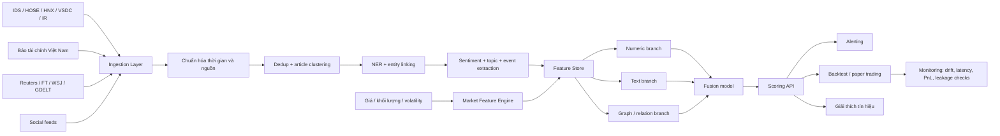
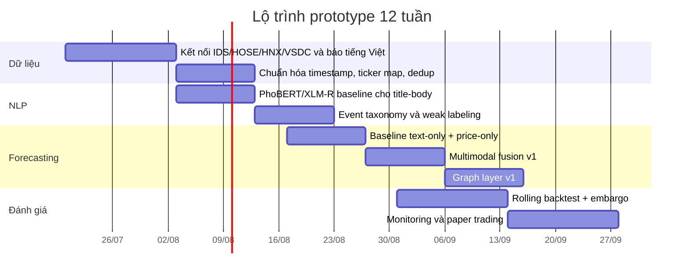

# Nghiên cứu sâu về dự báo biến động cổ phiếu từ tin tức hằng ngày và các thuật toán SOTA

## Tóm tắt điều hành

Dự báo biến động cổ phiếu từ tin tức hằng ngày **không phải** là bài toán “đọc sentiment rồi dự đoán tăng/giảm” một cách đơn giản. Các công trình gần đây cho thấy tín hiệu hữu ích xuất hiện khi hệ thống làm đúng bốn việc cùng lúc: gắn tin tức với **đúng thực thể** doanh nghiệp hoặc ngành; căn chỉnh **thời điểm công bố** với phiên giao dịch; mô hình hóa **độ bất ngờ** của sự kiện thay vì chỉ polarity cảm xúc; và kết hợp văn bản với **dữ liệu giá/khối lượng**, quan hệ liên cổ phiếu, cũng như sự tương tác giữa các bản tin. Những mô hình mới như FININ, MSGCA, THGNN, HATS và dòng graph/multimodal gần đây thường vượt rõ rệt các baseline chỉ dùng sentiment hoặc chỉ dùng chuỗi giá trong từng benchmark riêng của chúng. citeturn29search2turn14search16turn22search3turn22search5turn13search6

Điểm quan trọng nhất về mặt phương pháp là: **không có một “SOTA tuyệt đối” duy nhất** cho mọi thị trường, mọi horizon và mọi nhãn. Một mô hình có thể mạnh trên bài toán dự báo close-to-close của S&P 500 nhưng không chắc mạnh trên bài toán overnight open-gap, và càng không chắc phù hợp cho cổ phiếu Việt Nam nơi dữ liệu công khai, cấu trúc công bố thông tin và ngôn ngữ khác biệt. Vì vậy, cách tiếp cận thực tế nhất là xây một hệ thống đa tầng: nguồn dữ liệu đáng tin cậy, pipeline NLP theo miền tài chính, backbone chuỗi thời gian vững, và backtest nghiêm ngặt để loại rò rỉ thông tin. citeturn12search2turn32search0turn19search5turn21search0

Với bối cảnh Việt Nam, nút thắt lớn nhất hiện nay không phải thiếu mô hình, mà là thiếu **benchmark công khai chuẩn hóa** cho bài toán news-to-price bằng tiếng Việt. Trong các nguồn hiện có, phần mạnh nhất nằm ở dữ liệu chính thống từ UBCKNN/IDS, HOSE, HNX, VSDC và trang IR doanh nghiệp; dữ liệu báo chí tiếng Việt như Vietstock, CafeF, VnEconomy, VietnamBiz, Tin Nhanh Chứng Khoán, VietnamFinance, Người Quan Sát; cộng với các mô hình tiếng Việt như PhoBERT hoặc đa ngữ như XLM-R. Nhưng tôi không tìm thấy một benchmark Việt ngữ công khai, được cộng đồng dùng rộng rãi tương đương StockNet hay FNSPID cho bài toán gắn news với price movement. Điều đó khiến hướng đi tốt nhất là prototype theo kiểu **retrieval + entity/event extraction + multimodal forecasting + rolling backtest**, thay vì nhảy ngay vào một mô hình end-to-end quá lớn. citeturn23search0turn23search13turn2search0turn2search1turn2search7turn4search0turn1search1turn4search3turn25search1turn25search14turn17search10turn4search6turn9search8turn9search13turn17search3turn18search8turn27search0turn27search6

## Cơ chế suy ra biến động giá từ tin tức

Về mặt kinh tế học dữ liệu, tin tức tác động đến giá thông qua một chuỗi trung gian: **sự kiện → diễn giải của thị trường → dòng lệnh → biến động giá/khối lượng/độ biến động**. Nghiên cứu gần đây nhấn mạnh rằng sự lan truyền của tin vào giá là một quá trình **phức tạp, có độ trễ và có tương tác giữa các bản tin**, nên một headline đơn lẻ hiếm khi đủ để giải thích biến động. FININ đặc biệt quan trọng ở đây vì họ mô hình hóa không chỉ liên kết giữa news và price, mà còn **tương tác giữa các bản tin với nhau**, và báo cáo rằng market pricing of news có thể bị trì hoãn, có hiệu ứng “long memory”, đồng thời sentiment analysis thuần túy là chưa đủ để khai thác hết sức dự báo của tin tức. citeturn29search2turn14search16

Nếu mục tiêu là dự báo theo ngày, một trong những quyết định quan trọng nhất là chọn **horizon**. Bài toán close-to-close dễ định nghĩa nhưng rất dễ bị nhiễu vì trong ngày có vô số tín hiệu phi-văn-bản cùng tác động lên giá. Công trình LSTM-RGCN cho overnight movement nhấn mạnh rằng **tác động chính xác của news khó ước lượng theo thời gian**, nên dự báo khoảng **đóng cửa hôm trước → mở cửa hôm sau** là mục tiêu thực tế hơn cho tin sau giờ giao dịch, vì khi đó không có trading giữa hai mốc để “trộn” tín hiệu. Đây là lựa chọn rất phù hợp cho Việt Nam khi nhiều công bố thông tin doanh nghiệp xuất hiện cuối ngày trên hệ thống công bố thông tin và website doanh nghiệp. citeturn12search2turn12search5turn23search13

Vì thế, cách xác định “tin nào làm giá chạy” nên dựa trên năm trục chứ không chỉ sentiment: **độ mới**, **mức độ bất ngờ**, **loại sự kiện**, **mức độ liên quan thực thể**, và **bối cảnh thị trường**. Một báo cáo lợi nhuận “tăng” nhưng đúng như kỳ vọng có thể không tạo alpha; ngược lại, một thông tin pháp lý, nhân sự cấp cao, đứt gãy chuỗi cung ứng, thay đổi room ngoại hoặc guidance bất ngờ có thể tạo phản ứng lớn. Các dataset và khung event extraction trong tài chính như Doc2EDAG, CFTE, DocFEE và CAMEO/GDELT tồn tại chính vì coarse sentiment không đủ mô tả loại sự kiện thị trường quan tâm. citeturn24search0turn24search2turn24search6turn5search2turn5search10

Trong thực hành, nên coi bài toán này như một bài toán **event-conditioned forecasting**: trước hết tách các sự kiện tài chính có cấu trúc khỏi văn bản; sau đó ghép sự kiện đó vào chuỗi giá, thanh khoản và cấu trúc liên cổ phiếu; cuối cùng ra quyết định bằng mô hình dự báo có awareness về thời gian và quan hệ. Phương pháp này phù hợp hơn nhiều so với một pipeline “headline → sentiment score → buy/sell”, đặc biệt ở các thị trường mà tin chính thống và công bố doanh nghiệp quan trọng hơn social buzz. citeturn24search0turn24search2turn22search0turn22search5turn14search16

## Nguồn dữ liệu cần theo dõi hằng ngày

Đối với hệ thống thực chiến, tôi khuyến nghị **xếp nguồn dữ liệu theo độ tin cậy** như sau: **nguồn pháp lý/chính thức** ở mức cao nhất; tiếp đến là **sở giao dịch, tổ chức lưu ký, trang IR doanh nghiệp và hãng tin tài chính uy tín**; kế đó là **báo tài chính chuyên ngành**; cuối cùng mới là **mạng xã hội và cộng đồng nhà đầu tư**. Cách xếp này không chỉ hợp lý về nghiệp vụ mà còn phù hợp với chính cấu trúc công bố thông tin hiện hành ở Việt Nam, nơi UBCKNN vận hành IDS và doanh nghiệp niêm yết/đăng ký giao dịch tiếp tục thực hiện báo cáo, công bố qua hệ thống này cùng với cổng thông tin của sở giao dịch. citeturn23search0turn23search9turn23search13turn23search7

### Nguồn nên ưu tiên theo độ tin cậy

| Mức ưu tiên | Nhóm nguồn | Ví dụ ưu tiên cho Việt Nam | Giá trị phân tích chính | Ghi chú thực hành |
|---|---|---|---|---|
| Rất cao | Công bố pháp lý/chính thức | UBCKNN/IDS, HOSE, HNX, VSDC, website IR doanh nghiệp niêm yết citeturn23search0turn23search9turn2search0turn2search1turn2search7 | Báo cáo tài chính, NQ HĐQT, ĐHCĐ, thay đổi nhân sự, room ngoại, thực hiện quyền, cảnh báo/kiểm soát, niêm yết/hủy niêm yết | Nguồn “ground truth” cho event lớn; nên ingest đầu tiên |
| Cao | Nguồn nghiên cứu và trung gian tài chính có trách nhiệm nghề nghiệp | Vietcap, báo cáo phân tích CTCK, research houses nội địa citeturn25search3 | Consensus, định giá, earnings preview/review, sector notes | Không phải primary source nhưng hữu ích để đo “surprise vs expectation” |
| Trung bình-cao | Báo tài chính tiếng Việt chuyên ngành | Vietstock, CafeF, VnEconomy, Tin Nhanh Chứng Khoán, VietnamBiz, VietnamFinance, Người Quan Sát, Tạp chí Chứng khoán gắn với UBCKNN citeturn1search1turn4search0turn4search3turn25search1turn25search14turn17search10turn4search6turn25search0 | Tin tức doanh nghiệp, vĩ mô, ngành, cập nhật KQKD, dữ liệu bảng giá/market wrap | Nên dùng như lớp phát hiện sớm và đối chiếu chéo |
| Trung bình-cao | Hãng tin và báo quốc tế | Reuters, FT, WSJ Markets citeturn33search0turn33search4turn33search6turn33search3 | Spillover quốc tế, commodities, vĩ mô toàn cầu, China/US rates, trade policy | Đặc biệt quan trọng cho ngân hàng, dầu khí, xuất khẩu, logistics |
| Thấp | Social/community | Stocktwits, Reddit r/stocks/r/investing, các nhóm Facebook chứng khoán Việt Nam, X accounts phát tin nhanh citeturn34search0turn34search5turn34search13turn34search3turn34search15turn34search2 | Phát hiện narrative, retail flow, rumor tracking, sentiment crowd | Chỉ nên dùng như tín hiệu phụ, không làm ground truth |

Đối với người dùng Việt Nam, ưu tiên thực tế nhất là: **IDS/UBCKNN + HOSE/HNX/VSDC + IR doanh nghiệp** cho event chắc chắn; sau đó **Vietstock/CafeF/VnEconomy/Tin Nhanh Chứng Khoán/VietnamBiz/VietnamFinance/Người Quan Sát** để theo dõi liên tục trong ngày; và cuối cùng là Reuters/FT/WSJ cho các cú sốc quốc tế. Nếu nguồn lực hạn chế, chỉ cần làm tốt lớp đầu và lớp thứ hai đã đủ tạo một prototype rất mạnh cho VN30/HNX30. citeturn23search0turn2search0turn2search1turn2search7turn4search0turn1search1turn4search3turn25search1turn25search14turn17search10turn4search6turn33search4turn33search6turn33search3

### API và bộ dữ liệu mở nên dùng

| Loại | Nguồn/API | Định dạng | Điểm mạnh | Hạn chế |
|---|---|---|---|---|
| Market + news | Alpha Vantage | JSON/CSV qua API docs chính thức citeturn7search0turn7search3 | Có realtime/historical market data và News & Sentiment trong cùng hệ sinh thái | Free tier giới hạn mạnh |
| Market + company news | Finnhub | JSON API citeturn6search7turn7search1turn7search4 | Giá, fundamentals, company news, filings/transcripts ở một số gói | Nhiều endpoint news/sentiment thiên về Bắc Mỹ |
| Filings | SEC EDGAR APIs | JSON + XBRL + full-text search citeturn8search0turn8search4turn8search12 | Chuẩn cho filings Mỹ; rất tốt để học pipeline event extraction từ tài liệu pháp lý | Chủ yếu áp dụng cho thị trường Mỹ |
| Global news/events | GDELT 2.0 / Event Database / GKG | API + bảng sự kiện + taxonomy CAMEO citeturn5search10turn5search2turn5search6 | Bao phủ rộng, cập nhật thường xuyên, hữu ích cho macro/event tagging | Entity linking công ty niêm yết không phải lúc nào cũng sạch |
| Việt Nam market data | Vnstock | Python package + dữ liệu công khai chuẩn hóa citeturn5search0turn5search8turn5search4 | Dễ bắt đầu cho HOSE/HNX/UPCoM, thích hợp làm prototype | Là wrapper trên nguồn công khai, không thay thế data license chính thức |
| Open benchmark | StockNet dataset | JSON/CSV/TXT citeturn17search3turn17search7 | Benchmark cổ điển cho text + price | Dựa trên tweets Mỹ, không phải tiếng Việt |
| Open benchmark | FNSPID | Dataset + repo/GitHub citeturn18search8turn18search0 | Rất lớn: prices + financial news time-aligned 1999–2023 | Dành cho S&P500, không phải Việt Nam |
| Sentiment labels | Financial PhraseBank, FiQA | Câu/headline được gán nhãn citeturn17search8turn17search13turn17search9 | Tốt để fine-tune sentiment tài chính | Không trực tiếp là news-to-price benchmark |
| Việt ngữ tài chính | ViFinClass, nghiên cứu PhoBERT trên gần 40k bài báo, bộ 1,000 tiêu đề CafeF gán nhãn | Chủ yếu CSV/JSON qua paper/repo citeturn27search0turn26search4turn27search6 | Hữu ích cho topic classification, warm-start sentiment, domain adaptation | Chưa phải benchmark chuẩn news-to-price rộng rãi |

Đối với giai đoạn prototype, bộ công cụ cân bằng nhất là: **Vnstock để lấy giá Việt Nam**, crawler/ingestor cho **IDS + HOSE/HNX/VSDC + báo tài chính tiếng Việt**, và một nhánh quốc tế bằng **Reuters/FT + GDELT** để hấp thu các cú sốc vĩ mô. Nếu muốn benchmark mô hình trước khi chuyển sang Việt Nam, nên luyện pipeline trên **StockNet** hoặc **FNSPID** vì chúng có cấu trúc text-price rõ ràng và code cộng đồng sẵn hơn. citeturn5search8turn23search0turn2search0turn2search1turn2search7turn33search4turn33search6turn18search8turn17search3

## Dữ liệu, định dạng và tiền xử lý

### Kiểu dữ liệu và lược đồ dữ liệu tối thiểu

Một hệ thống news-to-price tốt cần ít nhất năm lớp dữ liệu: **giá/khối lượng theo thời gian**, **tin tức văn bản**, **filings/chứng từ pháp lý**, **quan hệ thực thể**, và **nhãn dự báo/backtest**. Các API chính thức hiện nay thường trả dữ liệu ở **JSON**; dataset học thuật thì hay ở **CSV/TXT/JSON**; filings hiện đại tốt nhất là **HTML/XBRL/JSON**, còn PDF nên xem là định dạng “fallback” khi không có bản máy đọc tốt hơn. Alpha Vantage và Finnhub cung cấp market/news qua API; SEC EDGAR cung cấp JSON/XBRL; StockNet và FNSPID minh họa cấu trúc benchmark chuẩn cho giá + tin; GDELT bổ sung event/message-level feed ở quy mô toàn cầu. citeturn7search3turn6search7turn8search4turn8search12turn17search3turn18search8turn5search10turn5search2

| Lớp dữ liệu | Tần suất | Trường bắt buộc tối thiểu | Định dạng khuyến nghị | Mục đích |
|---|---|---|---|---|
| Giá/khối lượng realtime | tick / 1s / 1m | timestamp, ticker, last/open/high/low/close, volume, bid/ask nếu có | JSON stream → Parquet/Delta | tốc độ phản ứng intraday |
| Dữ liệu intraday | 1m/5m/15m | OHLCV, VWAP, returns, realized vol | Parquet partitioned by date/ticker | học pattern intraday |
| Dữ liệu lịch sử | 1d/1w | OHLCV điều chỉnh, corporate actions | Parquet | huấn luyện dài hạn |
| Tin tức | realtime / batch | id, source, lang, published_at, headline, body, url, authors, tags | JSON + text blob | embedding, sentiment, event |
| Filings/công bố | event-driven | issuer, ticker, filing_type, event_time, attachment_url, text/html/pdf/xbrl | raw + normalized JSON | ground truth sự kiện |
| Social | realtime | post_id, user/meta, text, timestamp, cashtag/ticker | JSON | tín hiệu retail/narrative |
| Nhãn | theo horizon | label_time, horizon, up/down/neutral hoặc regression target | CSV/Parquet | huấn luyện/đánh giá |

Về nhãn sentiment và event, nên chuẩn hóa ít nhất ở hai tầng. **Tầng một** là polarity đơn giản như Financial PhraseBank hoặc FiQA để warm-start bộ mã hóa văn bản. **Tầng hai** là event tags có cấu trúc: earnings, guidance, M&A, legal/regulatory, major accident, equity pledge, shareholder reduction, bankruptcy/liquidation, management change, v.v. Các khung như CAMEO/GDELT, Doc2EDAG, DocFEE và CFTE cho thấy rõ lợi ích của biểu diễn sự kiện có cấu trúc so với sentiment ba lớp. citeturn17search8turn17search13turn5search2turn24search0turn24search2turn24search6turn24search10

### Tiền xử lý tin tức

Pipeline NLP cho news-to-price nên bắt đầu từ **chuẩn hóa timestamp** và **khử trùng lặp** trước cả khi đi vào tokenization. Trong môi trường tài chính, cùng một thông tin có thể được syndicated trên nhiều báo; nếu không gom cụm các bản gần giống nhau, mô hình sẽ đếm một sự kiện nhiều lần. Sau đó mới đến **language ID**, **tokenization/segmentation**, **NER**, **entity linking sang ticker/issuer**, **coreference**, **event extraction**, và cuối cùng là tạo embedding hoặc đặc trưng có cấu trúc. Với tiếng Việt, đây là bước đặc biệt quan trọng vì PhoBERT yêu cầu đầu vào **đã word-segmented**, và repo chính thức khuyến nghị dùng VnCoreNLP/RDRSegmenter để nhất quán với dữ liệu pretraining. citeturn30view0turn9search8turn9search0

Đối với mô hình ngôn ngữ, có ba chiến lược khả thi. Nếu hệ thống chủ yếu phục vụ **tiếng Việt**, dùng **PhoBERT** cho embedding/NER/classification là hợp lý vì đây là mô hình đơn ngữ mạnh cho tiếng Việt. Nếu cần trộn tiếng Việt với tiếng Anh/Trung hoặc muốn zero-shot tốt hơn, **XLM-R** thường là lựa chọn đa ngữ mạnh hơn mBERT trên nhiều benchmark cross-lingual. Nếu đầu vào là văn bản tài chính tiếng Anh như Reuters/FT/SEC, **FinBERT** và các FinLLM như **FinGPT/BloombergGPT** có lợi thế domain adaptation trong các tác vụ tài chính. citeturn9search8turn30view0turn9search13turn9search6turn15search8turn15search0turn15search5turn15search10turn15search2

Với event extraction, hướng đi mạnh nhất hiện nay là **document-level extraction** hơn là trigger-based câu đơn lẻ. Doc2EDAG chứng minh rằng trong văn bản tài chính, argument của cùng một sự kiện thường rải khắp nhiều câu; DocFEE và CFTE tiếp tục mở rộng theo hướng document-level, text-to-event và thậm chí generative structured output. Thực tế này rất gần với công bố thông tin doanh nghiệp Việt Nam, nơi một PDF/biên bản/nghị quyết thường chứa nhiều event arguments nằm cách xa nhau. citeturn24search0turn24search2turn24search6

Khâu **dịch máy** nên được xem là lớp phụ trợ chứ không phải thay thế văn bản gốc. Cách tốt nhất là lưu song song: văn bản gốc, bản dịch tiếng Anh và embedding của cả hai nếu dùng hệ đa ngữ. Điều này giúp tận dụng FinBERT/FinGPT cho tiếng Anh mà không mất tín hiệu ngôn ngữ bản địa. Với tiếng Việt, nếu nguồn lực hạn chế, tôi khuyên ưu tiên **PhoBERT/XLM-R trên văn bản gốc** trước, rồi mới thử nhánh dịch máy như một ablation. Cách làm này phù hợp hơn mức trưởng thành hiện tại của tài nguyên Việt ngữ tài chính. citeturn9search8turn9search13turn15search8turn15search10turn26search4turn27search6

### Tiền xử lý dữ liệu thị trường

Với dữ liệu thị trường, mục tiêu không chỉ là làm sạch OHLCV mà là đưa các series về một trạng thái **so sánh được, tránh leakage và có ý nghĩa theo horizon**. Bước tối thiểu gồm: chuẩn hóa múi giờ; xử lý ngày nghỉ/phiên giao dịch bất thường; resample về 1m/5m/1d tùy bài toán; chuẩn hóa corporate actions nếu nhà cung cấp có adjusted series; xây đặc trưng như return, log-return, gap close-open, realized volatility, turnover, intraday range, rolling z-score của volume, và trạng thái thị trường/sector. Dữ liệu benchmark như StockNet và các API market feeds cho thấy rõ cấu trúc chuẩn gồm timestamp, OHLCV và movement percent/return labels. citeturn17search3turn7search0turn6search7

Nếu bài toán là news-to-price, nên tách riêng ít nhất ba cửa sổ mục tiêu: **overnight**, **open-to-close intraday**, và **close-to-close**. Việc này giúp kiểm tra mô hình thật sự học được tác động của tin ngoài giờ hay chỉ đang lợi dụng động lượng giá. Với các nhãn phân loại, có thể bắt đầu bằng sign của return hoặc ngưỡng ±τ; khi đưa vào chiến lược giao dịch, triple-barrier labeling thường thực tế hơn vì nó mô hình hóa cả take-profit, stop-loss và time-expiry thay vì chỉ nhìn return cuối kỳ. citeturn12search2turn28search7turn28search10

## Thuật toán SOTA

### Nhận định chung về SOTA

Trong bài toán này, “SOTA” nên hiểu theo **họ phương pháp mạnh nhất trong từng nhánh** hơn là một mô hình duy nhất thắng mọi benchmark. Với phần ngôn ngữ, các encoder transformer thích nghi theo miền tài chính hoặc ngôn ngữ đích là nền tảng tốt nhất hiện nay. Với phần chuỗi thời gian, các backbone transformer/patch/mixer mới thường mạnh hơn LSTM thuần trên nhiều benchmark dự báo đa biến. Nhưng khi mục tiêu là **news-to-price**, các mô hình mạnh nhất thường là **multimodal hoặc graph-based**, vì chúng kết hợp được văn bản, giá, và mối quan hệ giữa các cổ phiếu hoặc giữa các bản tin. citeturn15search8turn9search8turn10search0turn10search1turn22search3turn14search16turn22search5turn13search6

### Mô hình NLP và trích xuất sự kiện

| Mô hình | Mô tả ngắn | Điểm mạnh | Điểm yếu | Input/Output điển hình | Nhu cầu dữ liệu/tính toán | Paper/repo đại diện |
|---|---|---|---|---|---|---|
| FinBERT | BERT tiếp tục pretrain trên miền tài chính để sentiment/NLP tài chính tốt hơn BERT gốc citeturn15search8turn15search0 | Mạnh cho sentiment, headline scoring, dễ fine-tune | Chủ yếu tiếng Anh; coarse sentiment chưa đủ cho event phức tạp | headline/body → sentiment class, embedding, score | Dữ liệu vừa; fine-tune 1 GPU thường đủ | Araci 2019; repo ProsusAI citeturn15search8turn15search0 |
| PhoBERT | RoBERTa đơn ngữ tiếng Việt; đầu vào phải word-segmented citeturn9search8turn30view0 | Rất phù hợp cho tiếng Việt, NER/classification mạnh | Không phải mô hình tài chính chuyên biệt; cần segmentation tốt | tiêu đề/bản tin tiếng Việt → embedding, NER, topic/sentiment | Dữ liệu vừa; compute thấp-trung bình | PhoBERT paper + repo chính thức citeturn9search8turn30view0 |
| XLM-R | Transformer đa ngữ quy mô lớn cho 100 ngôn ngữ citeturn9search13turn9search1 | Tốt cho pipeline đa ngữ và zero-shot | Dài/ngắn hạn không chuyên tài chính; chi phí inference cao hơn PhoBERT | text đa ngữ → embedding/classification | Dữ liệu vừa-lớn; 1–4 GPU tùy fine-tune | XLM-R 2020 citeturn9search13turn9search1 |
| mBERT | Baseline đa ngữ cổ điển | Dễ dùng, nhiều tài nguyên | Thường yếu hơn XLM-R trên cross-lingual | text → embedding/classification | Thấp-trung bình | mBERT analyses citeturn9search6turn9search14 |
| BloombergGPT / FinGPT | FinLLM cho tác vụ tài chính rộng | Mạnh cho reasoning/QA/summarization tài chính; hữu ích để gán nhãn yếu hoặc giải thích sự kiện | Chi phí cao, khó kiểm soát hallucination; không tự động là SOTA cho direction prediction | document set → summary, rationale, pseudo-label, extracted factors | Dữ liệu lớn; compute cao | BloombergGPT, FinGPT citeturn15search5turn15search10turn15search2 |
| Doc2EDAG / DocFEE / CFTE | Trích xuất sự kiện tài chính ở cấp tài liệu, có cấu trúc argument | Tốt hơn sentiment 3 lớp khi sự kiện dài/phức tạp | Gắn nhãn dữ liệu tốn công; nhiều benchmark hiện thiên về tiếng Trung | filing/news → structured event JSON/graph | Dữ liệu annotation chuyên biệt; compute trung bình-cao | Doc2EDAG, DocFEE, CFTE citeturn24search0turn24search2turn24search6turn24search10 |

Nhánh NLP mạnh nhất trong triển khai thực tế thường không phải là “gọi LLM để đoán tăng/giảm”, mà là dùng mô hình ngôn ngữ để tạo ra **biểu diễn giàu thông tin hơn**: sentiment calibrated, entity spans, event tags, topic, novelty score, cross-article similarity, và embeddings ở mức câu/tài liệu. Trên thị trường Việt Nam, **PhoBERT + event/topic/sentiment heads** là điểm khởi đầu hợp lý nhất; còn nếu cần quan sát đồng thời tin quốc tế và nội địa, mô hình kết hợp **PhoBERT cho tiếng Việt + FinBERT/XLM-R cho tiếng Anh/đa ngữ** thường thực dụng hơn một LLM khổng lồ. citeturn30view0turn15search8turn9search13turn26search4turn27search6

### Mô hình chuỗi thời gian

| Mô hình | Mô tả ngắn | Điểm mạnh | Điểm yếu | Input/Output điển hình | Nhu cầu dữ liệu/tính toán | Paper/repo đại diện |
|---|---|---|---|---|---|---|
| LSTM | RNN cổ điển cho dependencies theo thời gian citeturn11search1 | Baseline mạnh, dễ giải thích, tốt với cửa sổ vừa | Khó mở rộng context dài; tuần tự nên chậm training hơn model song song | OHLCV/features → class/regression | Thấp-trung bình | Hochreiter & Schmidhuber 1997 citeturn11search1 |
| TCN | Convolution dilated cho sequence modeling citeturn11search4turn11search12 | Song song hóa tốt, receptive field dài, baseline mạnh | Ít tự nhiên hơn attention cho exogenous multiscale context | series → forecast/class | Thấp-trung bình | Bai et al. + code locuslab citeturn11search4turn11search12 |
| TFT | Temporal Fusion Transformer cho multi-horizon forecasting, có tính giải thích tương đối citeturn11search2 | Kết hợp covariates tĩnh/động tốt, useful cho multi-horizon | Kiến trúc phức tạp hơn, tuning khó | multivariate series + covariates → multi-horizon forecast | Trung bình | Google Research TFT citeturn11search2 |
| Informer | Transformer hiệu quả cho chuỗi dài citeturn11search7turn11search11 | Tốt cho long sequence forecasting, inference nhanh hơn transformer gốc | Không phải lúc nào thắng trên benchmark mới hơn | long lookback → long horizon | Trung bình-cao | Informer AAAI + repo citeturn11search7turn11search11 |
| PatchTST | Chia chuỗi thành patch, channel-independent transformer citeturn10search0turn10search4 | Rất mạnh cho multivariate TS, context dài, dễ plug-in | Chưa tự thân xử lý text/news | numeric series → forecast/embedding | Trung bình | PatchTST paper + official code citeturn10search0turn10search4 |
| TimeMixer | MLP multiscale decomposition/mixing citeturn10search1turn10search5 | Hiệu quả, ít tốn hơn nhiều transformer, mạnh trên benchmark mới | Chủ yếu numeric TS; cần fusion layer với text | series → forecast | Trung bình | TimeMixer paper + code citeturn10search1turn10search5 |
| Diffusion TS | Probabilistic forecasting bằng diffusion như mr-Diff, NsDiff citeturn10search14turn10search10turn10search2 | Mạnh khi cần phân phối dự báo, tail risk và uncertainty | Train/inference nặng; triển khai realtime khó | series + covariates → predictive distribution | Cao | mr-Diff, NsDiff, survey 2025 citeturn10search14turn10search10turn10search2 |
| Chronos | Time-series foundation model pretrained, probabilistic forecasting citeturn10search3turn10search19turn10search7 | Hấp dẫn cho zero-shot/few-shot, dùng như backbone numeric branch | Không phải mô hình news-native; fusion với text vẫn phải tự thiết kế | numeric context → quantile/trajectory forecasts | Trung bình-cao | Chronos paper + official repo citeturn10search3turn10search19turn10search7 |

Trong bài toán news-to-price, backbone chuỗi thời gian tốt nhất hiện nay thường được dùng theo cách **“numeric specialist”**: PatchTST/TimeMixer/TFT/Chronos xử lý giá, khối lượng, vol, market state; sau đó phần văn bản được nối vào ở lớp fusion hoặc gating. Đây là hướng khả thi hơn nhiều so với cố bắt một FinLLM duy nhất vừa đọc tin vừa học mọi cấu trúc time series phức tạp. citeturn10search0turn10search1turn11search2turn10search3turn14search16turn22search3

### Mô hình multimodal và graph-based

| Mô hình | Mô tả ngắn | Điểm mạnh | Điểm yếu | Input/Output điển hình | Nhu cầu dữ liệu/tính toán | Paper/repo đại diện |
|---|---|---|---|---|---|---|
| StockNet | Kết hợp tweets và historical prices cho prediction đầu ngày/đầu phiên citeturn1search0turn17search7 | Benchmark cổ điển, dễ tái lập | Dữ liệu cũ, dựa mạnh vào Twitter Mỹ | tweets + price → direction | Trung bình | ACL 2018 + code/dataset citeturn1search0turn17search3turn17search7 |
| MAN-S | Multimodal attentive model dùng social text + company correlations citeturn14search5turn14search1 | Cho thấy lợi ích rõ của text + graph | Chủ yếu social; phụ thuộc quality correlation graph | social/news + prices + company relations → direction | Trung bình-cao | EMNLP 2020 + author code citeturn14search5turn14search1 |
| HATS | Hierarchical Graph Attention cho relation types khác nhau citeturn13search6turn22search0 | Mạnh khi nhiều quan hệ liên công ty; có code chính thức | Relation graph cần được xây tốt; có thể cứng nhắc nếu quan hệ động | company graph + features → node/graph prediction | Trung bình-cao | HATS paper + official repo citeturn13search6turn22search0 |
| LSTM-RGCN | Graph network cho overnight prediction, dùng Reuters news + stock relations citeturn12search2turn12search5 | Rất hợp logic “news sau giờ → open hôm sau”; nhấn mạnh inter-stock effects | Quan hệ stock handcrafted/correlation-based có thể kém linh hoạt | overnight news + price history + stock graph → overnight movement | Trung bình-cao | IJCAI 2020 citeturn12search2turn12search5 |
| THGNN | Temporal + heterogeneous graph neural network học quan hệ động giữa cổ phiếu citeturn22search5turn22search2 | Học quan hệ động ngày-qua-ngày tốt hơn graph tĩnh | Chủ yếu dùng numeric relation graph; text branch phải ghép thêm | temporal stock graph + price features → movement probability | Cao | ACM 2022/2023 + official repo citeturn22search5turn22search2 |
| FININ | News influence network mô hình hóa tương tác giữa các bản tin và giá trên 2.7M bài báo/15 năm citeturn14search16turn14search4 | Rất mạnh về mặt ý tưởng và benchmark; trực diện bài toán diffusion của news | Khá nặng về dữ liệu và xây đồ thị tin; chưa thấy official code dễ dùng | news graph + market features → prediction/trading score | Cao | Findings EMNLP 2024 citeturn14search16turn14search4 |
| MSGCA | Stable multimodal fusion bằng gated cross-attention, xử lý indicators + documents + relation graph citeturn22search3turn22search6 | Đại diện tốt cho lớp fusion hiện đại, khắc phục xung đột giữa modality | Kiến trúc phức tạp, tuning nhiều | indicators + docs + graph → movement class | Cao | 2024/2025 + repo chính thức citeturn22search3turn22search6 |

Nếu phải chọn các nhánh “đỉnh” theo mục tiêu triển khai, tôi sẽ xếp như sau. **NLP/text branch:** FinBERT cho tiếng Anh, PhoBERT cho tiếng Việt, XLM-R khi cần đa ngữ. **Numeric branch:** PatchTST hoặc TFT/TimeMixer để xử lý covariates. **Relational branch:** HATS/THGNN cho graph động hoặc đa quan hệ. **Fusion branch:** FININ/MSGCA là các đại diện rất đáng chú ý vì chúng giải đúng bản chất bài toán là **tương tác của news trong không gian thời gian-thực thể**, không phải sentiment tuyến tính. citeturn15search8turn9search8turn9search13turn10search0turn11search2turn10search1turn22search5turn13search6turn14search16turn22search3

### Bảng so sánh các phương pháp nổi bật

| Phương pháp | Modality | Nhu cầu dữ liệu | Độ trễ suy luận | Độ chính xác/độ vững kỳ vọng | Code availability | Mức trưởng thành |
|---|---|---|---|---|---|---|
| FinBERT + booster/vector model citeturn15search8turn15search0 | Text | Vừa | Thấp | Khá, nhưng dễ hụt event phức tạp | Có official repo | Cao |
| PhoBERT + classifier/event heads citeturn9search8turn30view0 | Text tiếng Việt | Vừa | Thấp | Khá cho Việt ngữ; phụ thuộc segmentation và nhãn | Có official repo | Cao cho NLP, trung bình cho news-to-price |
| XLM-R + multimodal head citeturn9search13turn9search1 | Text đa ngữ | Vừa-lớn | Thấp-trung bình | Khá-cao khi nguồn tin đa ngữ | Có model/paper chính thức | Cao |
| PatchTST + text fusion citeturn10search0turn10search4 | Numeric + text | Lớn hơn text-only | Trung bình | Cao nếu numeric branch mạnh và alignment chuẩn | Có official code | Cao |
| TFT + exogenous news factors citeturn11search2 | Numeric + exogenous text features | Vừa-lớn | Trung bình | Cao, nhất là multi-horizon | Implementations nhiều, paper chính thức | Cao |
| HATS citeturn13search6turn22search0 | Graph + numeric/text features | Lớn | Trung bình-cao | Cao khi relation graph tốt; vững hơn stock-independent | Có official repo | Trung bình-cao |
| LSTM-RGCN overnight citeturn12search2turn12search5 | News + price + graph | Lớn | Trung bình-cao | Rất hợp cho bài toán overnight | Không phải repo phổ biến như HATS/THGNN | Trung bình-cao |
| THGNN citeturn22search5turn22search2 | Temporal graph + price | Lớn | Cao | Cao cho quan hệ động giữa cổ phiếu | Có official repo | Trung bình-cao |
| FININ citeturn14search16turn14search4 | News network + market data | Rất lớn | Cao | Rất cao trong benchmark riêng; đặc biệt tốt cho news diffusion | Chưa thấy official repo phổ biến | Trung bình |
| MSGCA citeturn22search3turn22search6 | Indicators + documents + graph | Rất lớn | Cao | Rất cao trong bài toán fusion đa modality | Có repo chính thức | Trung bình |

Bảng trên nên được đọc như **định tính triển khai**, không phải bảng xếp hạng tuyệt đối. “Độ chính xác/độ vững kỳ vọng” ở đây là tổng hợp từ paper, repo và đặc tính kiến trúc, vì các công trình dùng universe, horizon, nhãn và transaction assumptions khác nhau nên hiếm khi so trực tiếp được một cách công bằng. citeturn32search0turn14search16turn22search3turn22search5turn13search6

## Đánh giá, benchmark và các bẫy phương pháp luận

### Metrics nên dùng

Nếu đầu ra là **phân loại hướng đi**, đừng chỉ dùng accuracy. Trong dữ liệu tài chính, class imbalance rất phổ biến, đặc biệt nếu có lớp neutral/no-move hoặc khi phần lớn ngày biến động nhỏ. Vì vậy, bộ metric nên có **balanced accuracy, F1, MCC, precision/recall theo lớp, AUC-PR**; trong đó MCC đặc biệt hữu ích khi dữ liệu lệch lớp vì nó sử dụng toàn bộ confusion matrix thay vì chỉ nhìn tỷ lệ đúng tổng thể. citeturn31search6turn19search5

Nếu đầu ra là **hồi quy hoặc phân phối dự báo**, nên báo **MAE/RMSE** cho point forecast, và nếu là probabilistic forecast thì thêm pinball loss/CRPS hoặc calibration theo quantile. Tuy nhiên, với bài toán news-to-price, metric học máy chỉ là lớp đầu. Lớp quyết định cuối cùng phải là **trading utility**: hit ratio, annualized return, Sharpe, Sortino, max drawdown, turnover, slippage-adjusted PnL. FININ là ví dụ tốt vì họ nhấn mạnh cả lợi ích trên **daily Sharpe ratio**, không chỉ đúng-sai của label. citeturn14search16turn14search4

### Benchmark setup và baseline tối thiểu

Benchmark chuẩn cho bài toán này nên luôn có ít nhất bốn baseline. **Baseline một** là “no-change” hoặc sign persistence để kiểm tra xem mô hình có hơn heuristic không. **Baseline hai** là price-only model như LightGBM/LSTM/TCN/PatchTST. **Baseline ba** là text-only model như FinBERT/PhoBERT + linear head. **Baseline bốn** là multimodal fusion. Nếu mô hình SOTA không đánh bại được cả price-only và text-only baseline một cách ổn định, thường nghĩa là fusion đang không tạo giá trị thật. Các benchmark gần đây như BenchStock cũng được đề xuất chính vì cộng đồng cần một cách so sánh thống nhất hơn giữa nhiều họ mô hình. citeturn32search0turn10search0turn11search4turn15search8turn9search8

Về chia tập, phải dùng **rolling/expanding window theo thời gian** chứ không dùng random split. Với horizon chồng lấn, nên thêm **gap/embargo/purging** để tránh việc train nhìn thấy thông tin rò từ khoảng thời gian có giao nhau với test. Tài liệu của scikit-learn nhấn mạnh leakage là dùng thông tin không có sẵn tại thời điểm dự đoán; trong tài chính, điều này còn nghiêm trọng hơn vì nhãn thường phụ thuộc giá tương lai. Các khung đánh giá như purged CV/CPCV được dùng chính để giảm temporal leakage và overfitting của backtest. citeturn19search5turn19search1turn20search5turn20search14turn21search0

### Các bẫy lớn nhất

Bẫy số một là **lookahead bias** ở timestamp. Nhiều hệ thống “rò” đơn giản vì dùng `published_at` của bài báo theo giờ địa phương khác nhau, hoặc dùng bản article đã được cập nhật sau đó, hoặc ghép nhãn close-to-close cho một bài thực ra xuất hiện sau khi thị trường đóng cửa. Với Việt Nam, cần khóa chặt timezone Asia/Ho_Chi_Minh và đánh dấu rõ pre-open, during-session, after-close cho từng bản tin. Overnight objective của LSTM-RGCN là một cách rất tốt để giảm ambiguity này trong giai đoạn đầu. citeturn12search2turn19search5

Bẫy số hai là **backtest overfitting**. Bailey và cộng sự cho thấy trong nghiên cứu đầu tư, việc thử nhiều đặc trưng, nhiều nhãn, nhiều ngưỡng và nhiều chiến lược rồi chọn cấu hình đẹp nhất có thể dẫn đến xác suất overfit rất cao ngay cả khi có hold-out thông thường. Vì vậy, ngoài OOS theo thời gian, nên thêm **PBO-style thinking**, multiple-comparison discipline, và chỉ khóa một test set cuối cùng sau khi chốt pipeline. citeturn21search0turn21search2

Bẫy số ba là **survivorship bias** và **entity resolution lỗi**. Nếu universe cổ phiếu chỉ giữ lại những mã còn tồn tại đến cuối mẫu, hoặc nếu mã đổi tên/đổi niêm yết/hủy niêm yết không được xử lý, mô hình sẽ lạc quan giả tạo. Tương tự, nếu một bài báo nói về tập đoàn mẹ nhưng được gán nhầm sang công ty con niêm yết, hoặc ngược lại, tín hiệu text sẽ tự hủy giá trị. Đây là lý do lớp NER + entity linking + company master table quan trọng gần bằng mô hình dự báo. citeturn22search0turn22search5turn23search0

## Thiết kế hệ thống thực chiến và lộ trình prototype

### Kiến trúc khuyến nghị

Một hệ thống thực tế nên tách thành các lớp độc lập: **ingestion**, **normalization**, **NLP/event extraction**, **feature store**, **forecasting & alerting**, **backtesting**, và **monitoring**. Lớp ingestion nên ưu tiên polling/webhook cho nguồn chính thống như IDS/HOSE/HNX/VSDC và feeds báo; lớp normalization đồng bộ timestamp, ticker mapping, dedup/clustering; lớp NLP sinh embeddings, sentiment, event tags, novelty score; feature store giữ cả features tức thời lẫn features theo horizon; model server trả ra điểm số xác suất/tín hiệu; cuối cùng là alerting và chiến lược backtest. Cấu trúc này bền hơn nhiều so với một notebook “scrape rồi train end-to-end”. citeturn23search0turn23search13turn2search0turn2search1turn2search7turn14search16turn22search3



Về độ trễ, có thể chia thành hai mode. **Mode theo ngày/overnight**: chấp nhận batch vài phút sau khi có công bố, ưu tiên độ chắc chắn và đầy đủ tài liệu. **Mode intraday**: ưu tiên latency thấp, dùng headline-first scoring rồi cập nhật khi có full article/filing parsed xong. Với prototype ở Việt Nam, tôi khuyên bắt đầu bằng **overnight + early-morning pre-open scoring** vì dễ thiết kế nhãn đúng hơn và bám sát logic công bố thông tin doanh nghiệp. citeturn12search2turn23search13

### Stack triển khai và monitoring

Về stack, lựa chọn thực dụng là: **Python** cho NLP/modeling; **Kafka hoặc queue tương đương** cho ingest; **Parquet/Delta Lake hoặc object storage phân vùng theo ngày/ticker** cho historical lake; **Postgres/ClickHouse** cho event tables; **PyTorch + Hugging Face** cho mô hình ngôn ngữ; và một tầng serving mỏng bằng **FastAPI/gRPC**. Đây là lựa chọn kỹ thuật, không phải yêu cầu bắt buộc, nhưng nó phù hợp với phần lớn repo/papers hiện hành như PhoBERT, FinBERT, PatchTST, HATS, THGNN, MSGCA. citeturn30view0turn15search0turn10search4turn22search0turn22search2turn22search6

Monitoring nên có ít nhất bốn dashboard. **Data quality**: tỷ lệ parse lỗi, trễ ingest, trễ entity linking, số bài duplicate. **Model quality**: calibration, feature drift, embedding drift, class prior drift. **Trading quality**: hit ratio, Sharpe, PnL sau phí, turnover và slippage. **Research safety**: cảnh báo leakage, train/test overlap, phiên bản nhãn, và tái lập thí nghiệm. Nếu không có lớp thứ tư, rất dễ “đẹp trên backtest, hỏng ngoài đời”. citeturn19search5turn21search0

### Pipeline mẫu và pseudocode

Về mặt thuật toán, pipeline prototype tốt nhất ở Việt Nam nên là:

1. Thu tin từ IDS/HOSE/HNX/VSDC và 5–8 báo tài chính tiếng Việt theo polling lịch.
2. Chuẩn hóa timestamp và dedup các bản giống nhau.
3. Chạy PhoBERT cho title/body embedding, NER company/person/org; chạy một head sự kiện hoặc rules+LLM để tạo `event_type`.
4. Gắn bài viết vào ticker bằng company alias table.
5. Đồng bộ với features thị trường 1d và overnight.
6. Dự báo bằng một fusion model vừa phải, ví dụ `PhoBERT embedding + market features + sector graph`.
7. Xuất ra `score_up`, `score_down`, `event_summary`, `top_rationale`.
8. Backtest rolling theo horizon cố định và khóa phí/tính thanh khoản. citeturn30view0turn26search4turn22search0turn22search5

```python
# Pseudocode minh họa

news_batch = ingest_sources(
    official=["IDS", "HOSE", "HNX", "VSDC", "issuer_ir"],
    media=["Vietstock", "CafeF", "VnEconomy", "VietnamBiz", "Tinnhanhchungkhoan"]
)

news_batch = normalize_timestamps(news_batch, tz="Asia/Ho_Chi_Minh")
news_batch = deduplicate_and_cluster(news_batch)

for article in news_batch:
    article.lang = detect_language(article.text)
    article.text_seg = vietnamese_segment(article.text) if article.lang == "vi" else article.text
    article.entities = ner_and_link(article.text_seg)
    article.event = extract_financial_event(article.text_seg, article.entities)
    article.embed = text_encoder(article.text_seg)

market_feats = build_market_features(
    bars=load_bars(["1d", "1m"]),
    windows=[1, 5, 20, 60],
    extra=["overnight_gap", "realized_vol", "turnover_z", "sector_return"]
)

graph_feats = build_relation_graph(
    method="sector+historical_correlation",
    entities=universe_companies
)

X = join_on_time_and_ticker(news_batch, market_feats, graph_feats)
y = label_targets(method="overnight_or_triple_barrier")

model = train_fusion_model(X_train, y_train)
pred = model.predict_proba(X_test)

alerts = generate_alerts(
    pred,
    threshold=0.6,
    require_event_types=["earnings", "guidance", "legal", "management", "ownership_change"]
)

backtest(alerts, transaction_costs=True, slippage=True, embargo=True)
```

Nếu muốn đi nhanh nhưng không quá mạo hiểm, mô hình đầu tiên nên là một hệ **hai tầng**: tầng một chấm điểm bài viết (`text score`); tầng hai dùng `text score + market features` vào LightGBM/TFT/PatchTST nhỏ. Sau khi baseline này ổn định mới nâng lên HATS/THGNN/MSGCA/FININ-style fusion. Cách đi này thường cho tốc độ học hỏi tốt hơn rất nhiều so với bắt đầu từ graph multimodal nặng. citeturn15search8turn10search0turn11search2turn22search0turn22search5turn22search3turn14search16

### Cách gán nhãn sentiment và event

Đối với **sentiment**, nên dùng ba lớp `negative / neutral / positive` như Financial PhraseBank hoặc corpus Việt ngữ nhỏ hiện có để warm-start; sau đó hiệu chỉnh theo miền bằng nhãn tác động thị trường: “positive” nếu sau khi căn chỉnh thời gian và trừ benchmark/sector thì return hoặc overnight gap vượt ngưỡng; “negative” nếu thấp hơn ngưỡng âm; còn lại là neutral. Với tiếng Việt, có thể dùng bộ 1,000 tiêu đề CafeF gán nhãn để bắt đầu, sau đó mở rộng bằng weak supervision/LLM-assisted labeling. citeturn17search8turn27search6

Đối với **event**, tốt nhất là thiết kế taxonomy riêng cho trading trước rồi mới train extractor. Một taxonomy thực dụng cho Việt Nam có thể gồm: `earnings`, `earnings_guidance`, `dividend/corporate_action`, `ownership_change`, `major_contract`, `capital_raise`, `M&A`, `legal/regulatory`, `management_change`, `credit/rating`, `room_foreign`, `operational_disruption`, `macro_sector`. Các khung CAMEO/GDELT và các dataset tài chính document-level cho thấy event taxonomy càng rõ thì fusion với market data càng có ý nghĩa. citeturn5search2turn5search10turn24search2turn24search10

### Lộ trình triển khai prototype

Lộ trình 12 tuần dưới đây là cách đi cân bằng giữa tốc độ và độ đúng phương pháp. Nó ưu tiên lấy dữ liệu đáng tin cậy trước, dựng baseline trước, rồi mới tăng độ phức tạp mô hình. Cách tuần tự này giúp giảm xác suất backtest overfitting và thời gian lãng phí vào một kiến trúc quá nặng khi data plumbing còn chưa sạch. citeturn21search0turn19search5



### Bước tiếp theo và tài nguyên khuyến nghị

Nếu mục tiêu là một prototype có khả năng dùng được trong 2–3 tháng, tôi khuyên đi theo thứ tự này. **Bước đầu**, dựng data lake tin chính thống Việt Nam và giá Việt Nam bằng IDS/HOSE/HNX/VSDC + Vnstock; đây là nền móng không thể bỏ qua. **Bước hai**, fine-tune **PhoBERT** cho classification/topic/event sơ cấp trên tiếng Việt, đồng thời dùng **FinBERT** hoặc **XLM-R** cho nhánh tin quốc tế. **Bước ba**, dựng baseline fusion đơn giản bằng `text scoring + market features`. **Bước bốn**, khi baseline đã qua rolling backtest nghiêm ngặt, nâng lên graph/multimodal như **HATS**, **THGNN** hoặc **MSGCA-style fusion**; còn **FININ** nên xem là “đích nghiên cứu” cao hơn khi bạn đã có đủ hạ tầng dữ liệu và compute. citeturn5search8turn23search0turn23search13turn30view0turn15search0turn9search13turn22search0turn22search2turn22search6turn14search16

Các tài nguyên đáng cắm mốc đọc và tái lập gồm: **FinBERT** cho domain adaptation văn bản tài chính; **PhoBERT** cho tiếng Việt; **StockNet** và **FNSPID** cho benchmark text-price; **PatchTST**, **TFT**, **TimeMixer**, **Chronos** cho backbone chuỗi thời gian; **HATS**, **LSTM-RGCN**, **THGNN**, **FININ**, **MSGCA** cho fusion/graph; và **GDELT/SEC EDGAR** để học cách chuẩn hóa event/news/filings ở quy mô lớn. Với bối cảnh Việt Nam, thứ tạo lợi thế bền vững nhiều khả năng sẽ không phải là “mô hình lớn hơn”, mà là **dữ liệu sạch hơn, event taxonomy tốt hơn, và backtest nghiêm hơn**. citeturn15search8turn30view0turn17search3turn18search8turn10search0turn11search2turn10search1turn10search3turn13search6turn12search5turn22search5turn14search16turn22search3turn5search10turn8search4turn21search0turn19search5